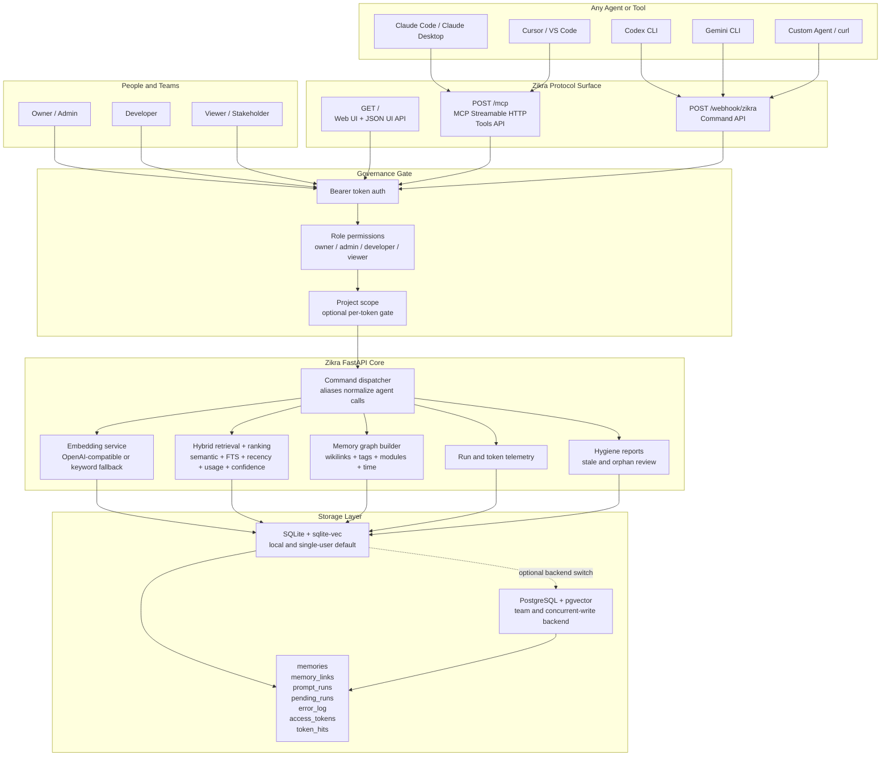
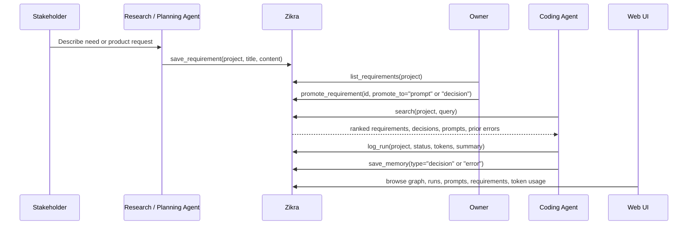
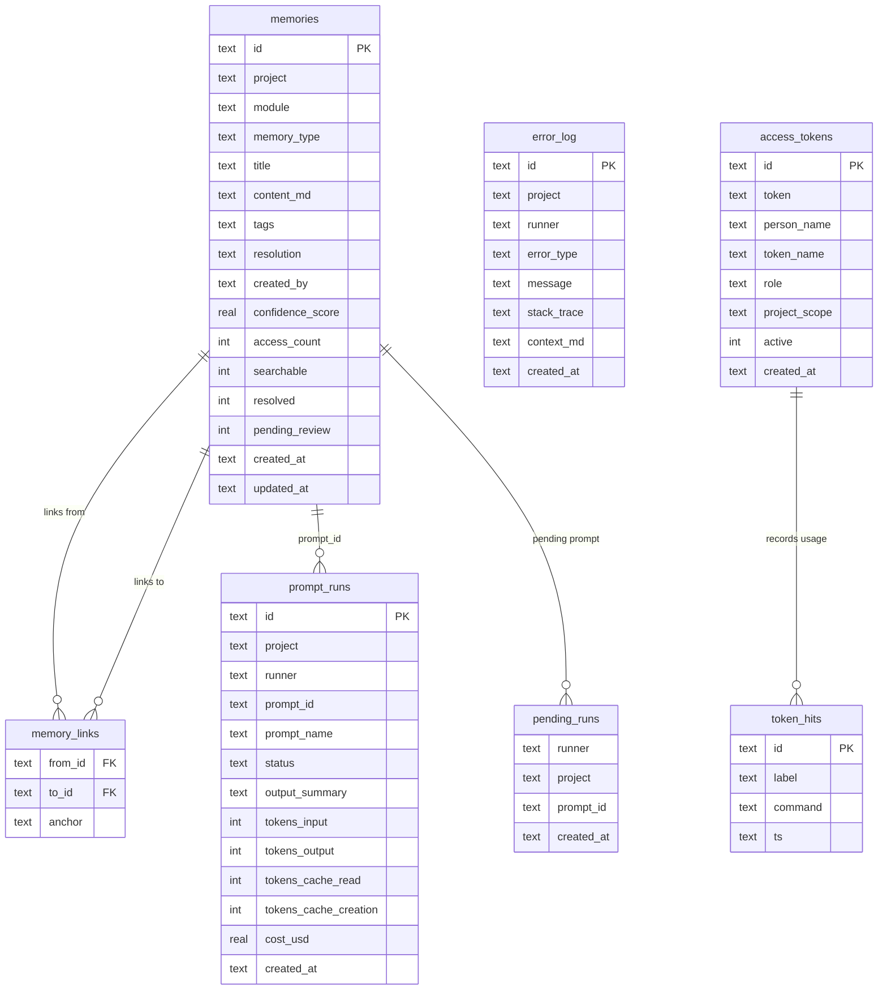

# Zikra Architecture

Zikra is an open-source memory layer for AI agents, built for teams that need
shared project context with real governance. It gives Claude Code, Gemini CLI,
Codex, Cursor, custom agents, and direct HTTP clients the same searchable memory
pool while preserving project boundaries through role-based tokens and optional
project scoping.

The key design choice is simple: Zikra is not only a personal memory cache. It is
project memory infrastructure. Memories are typed, scoped, ranked, linked,
auditable, and reusable across agents, people, projects, and machines.

## System diagram

## What makes the architecture different

### 1. Governed project memory

Zikra treats memory as a governed project resource. Every memory can carry a
project, module, memory type, tags, creator, resolution state, confidence score,
and access count. Tokens carry roles, and tokens can also be limited to one
project. That lets a team use one server without turning every agent into a
global administrator.

### 2. Agent-agnostic by design

Agents can call Zikra through two compatible surfaces:

- MCP tools at `POST /mcp` for MCP-native clients.
- Direct command calls at `POST /webhook/zikra` for CLI hooks, custom agents, and
  simple HTTP clients.

The command layer accepts aliases such as `find`, `recall`, `remember`, `save`,
and `store`, which makes Zikra forgiving when different agents use slightly
different language.

### 3. Typed memory, not raw chat history

Zikra stores distinct memory types:

- `decision` for architecture and product decisions.
- `requirement` for requested work.
- `prompt` for reusable runbooks.
- `conversation` for session summaries and handoffs.
- `error` for failures and debugging context.
- `note` for general project knowledge.

This gives agents a better retrieval surface than a flat transcript pile.

### 4. Search that degrades gracefully

When embeddings are available, Zikra performs semantic retrieval and combines it
with keyword search. When embeddings are unavailable, it still works as a
keyword-backed memory server. Ranking is adjusted by age, access frequency, and
confidence so frequently useful memories stay visible without deleting older
context.

### 5. Team workflow loop

## Runtime components

| Component | Role |
| --- | --- |
| FastAPI server | Owns HTTP routes, lifecycle, UI endpoints, webhook dispatch, MCP transport, and health checks. |
| MCP server | Exposes Zikra tools over Streamable HTTP at `/mcp`; legacy SSE endpoints are retained for compatibility. |
| Command modules | Small command handlers for search, save, prompts, requirements, run logs, errors, schema, hygiene, and token creation. |
| Auth layer | Verifies bearer tokens, maps roles, and enforces project scope. |
| Embedding layer | Uses an OpenAI-compatible embeddings endpoint when configured; falls back to keyword-only mode when not. |
| Scoring layer | Re-ranks search results with recency decay, access frequency, and confidence. |
| SQLite backend | Default local backend using FTS5 and sqlite-vec. |
| Postgres backend | Optional team backend using asyncpg and pgvector. |
| Web UI | Browser interface for memories, graph view, prompts, requirements, runs, users, and token usage. |
| Hooks | Claude Code, Gemini CLI, Codex CLI, shell, and statusline integrations that capture runs and keep context fresh. |

## Data model

## Request flow

### Search

1. Agent calls `zikra_search` over MCP or sends `{"command": "search"}` to the
   webhook.
2. Zikra authenticates the token, checks the caller role, and applies project
   scope.
3. The query is embedded if an embeddings endpoint is configured.
4. Zikra retrieves candidates using vector search and full-text search.
5. Results are re-ranked with recency, access count, and confidence.
6. The response is clipped to the requested token budget.

### Save

1. Agent sends a typed memory with `title`, `project`, `content_md`, and optional
   metadata.
2. Zikra embeds title plus content when embeddings are available.
3. The backend inserts or updates the unique `(title, memory_type, project)` row.
4. Full-text and vector indexes are refreshed.
5. `[[wikilinks]]` inside the content become graph edges in `memory_links`.

### Prompt run

1. Agent fetches a saved prompt.
2. Zikra records a pending prompt/run handshake for the caller's runner and
   project.
3. Agent completes the task and calls `log_run`.
4. Zikra links the run back to the prompt and records status, token counts,
   cache usage, cost, and summary.

## Deployment profiles

| Profile | Best for | Backend | Notes |
| --- | --- | --- | --- |
| Local | One developer, one machine, quick start | SQLite + sqlite-vec | Default install path. |
| Shared server | Small team or public tunnel | SQLite or Postgres | Use token roles and project scopes. |
| Team backend | Multiple agents and concurrent writes | PostgreSQL + pgvector | Recommended for production teams. |

## Architecture review

Zikra's strongest architectural asset is that it sits at the right abstraction
layer. It is lower than an agent framework and higher than a plain vector store:
agents do not need to know about schemas, indexes, rankings, prompt/run
handshakes, or project gates. They only need to call memory tools.

The second strength is protocol flexibility. MCP gives Zikra a standard
integration path for modern AI clients, while the webhook gives every shell hook,
automation script, and custom agent a stable fallback.

The third strength is that project management concepts are first-class enough to
matter. Requirements, decisions, prompts, runs, token usage, stale memory, and
graph links are all represented in the system. That is the foundation for the
"governed project memory" category.

## Design direction

The clearest next step is to keep pushing Zikra toward team-grade memory
operations:

- First-class team and workspace records above projects.
- Project dashboards that show requirements, decisions, prompts, runs, and stale
  memory in one view.
- Richer approval states for requirement-to-decision and requirement-to-prompt
  workflows.
- More agent installers and examples so every tool feels like a native Zikra
  client.
- Public demo data that lets new users understand the system in one minute.

## Positioning summary

Most memory projects answer: "How does one agent remember a user?"

Zikra answers: "How does a team govern project memory across many agents?"

That is the sharper category. The architecture already supports it: protocol
agnostic entrypoints, typed memories, project scopes, RBAC, run telemetry,
requirements, prompts, graph links, and a self-hosted storage layer.
